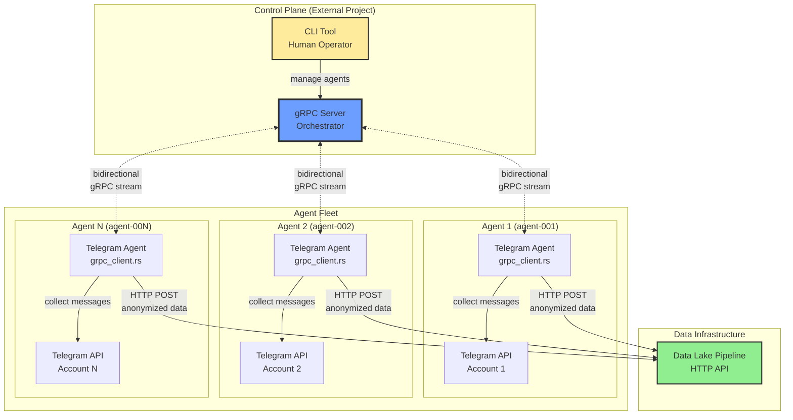
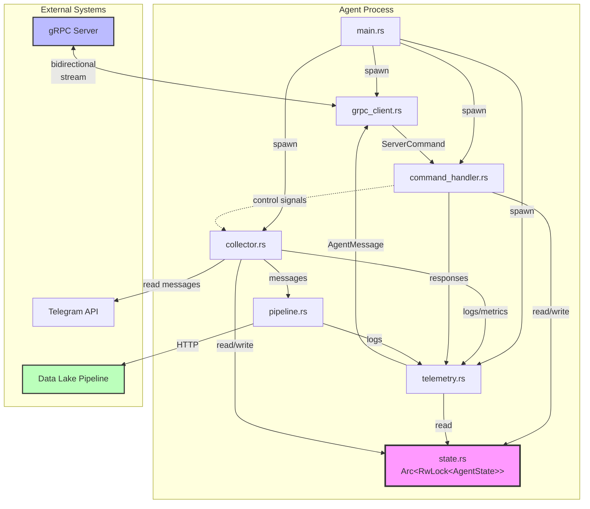
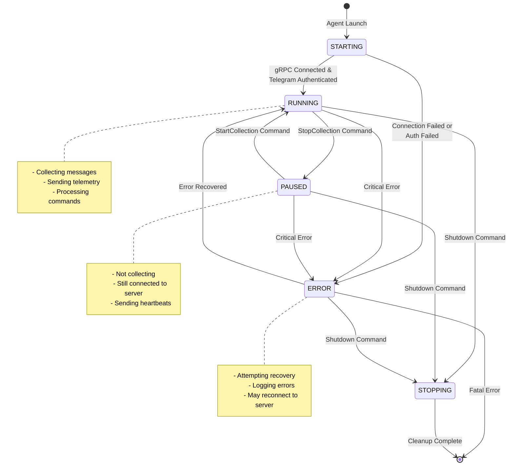
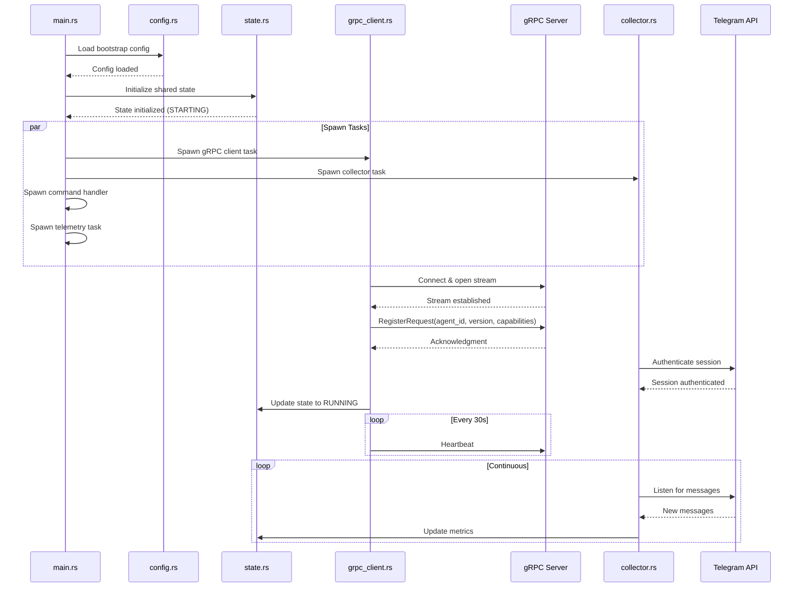
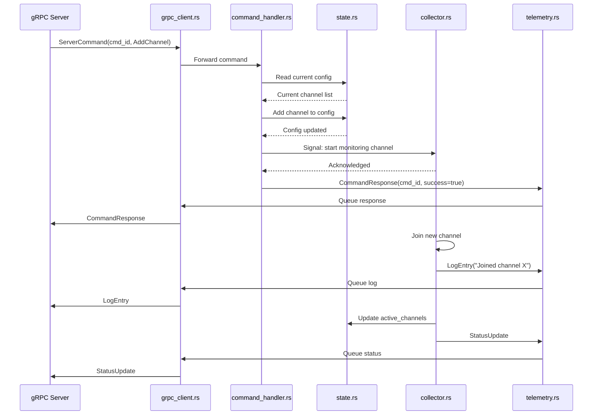
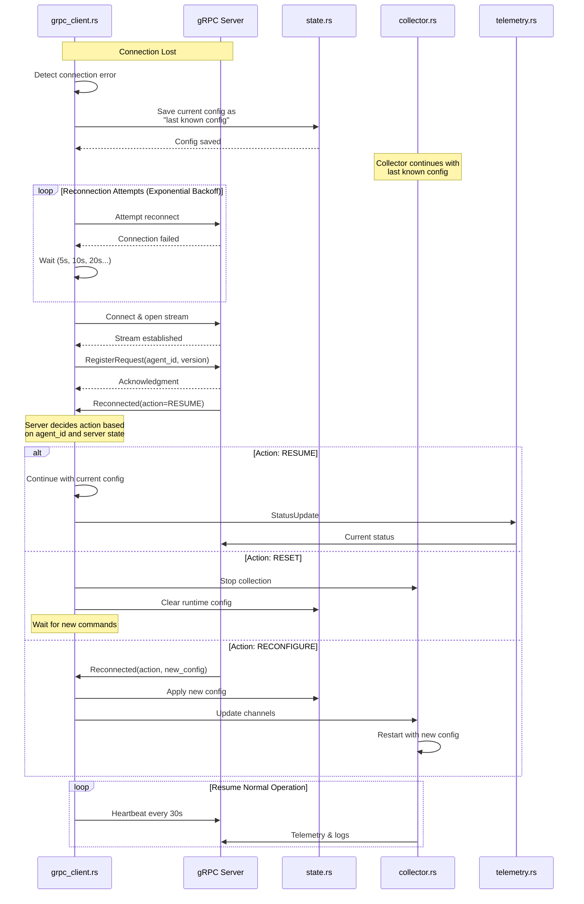
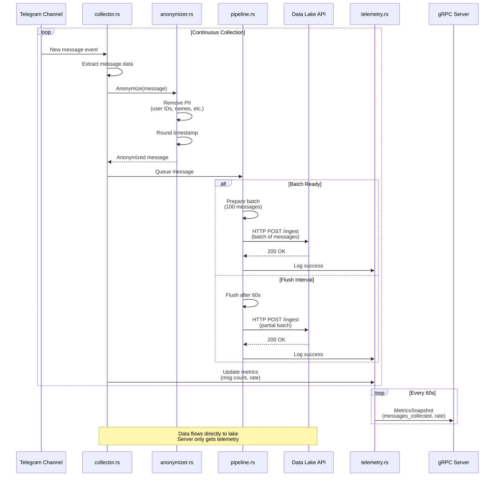

# gRPC Client Integration Design

## Overview

This document describes the architecture for integrating a gRPC client into the Telegram agent, enabling remote management and orchestration via an external gRPC server.

## Architecture

### High-Level Design

```
┌─────────────────────────────────────┐
│   External gRPC Server (Separate)   │
│   - Orchestration Dashboard          │
│   - Multi-agent Management           │
│   - Command & Control                │
└──────────────┬──────────────────────┘
               │ Bidirectional Stream
               │ (Commands ↓ | Telemetry ↑)
    ┌──────────┴──────────┬──────────────┬───────────
    │                     │              │
┌───▼────┐           ┌───▼────┐    ┌───▼────┐
│Agent 1 │           │Agent 2 │    │Agent N │
│gRPC ←──┤           │gRPC ←──┤    │gRPC ←──┤
│Client  │           │Client  │    │Client  │
└───┬────┘           └───┬────┘    └───┬────┘
    │                     │              │
    ↓                     ↓              ↓
Data Lake            Data Lake      Data Lake
Pipeline             Pipeline       Pipeline
```

### Deployment Architecture Diagram



### System Components

**This Project (tg-agent-experiment)**:
- Telegram agent with embedded gRPC client
- Connects to external gRPC server
- Receives commands from server
- Reports status/telemetry back to server
- Sends collected data directly to data lake pipeline

**External Project (Separate)**:
- gRPC server acting as orchestration control plane
- Manages multiple Telegram agent instances
- Sends commands to agents (start/stop, add channels, configure)
- Receives telemetry, status, and logs from agents
- Provides CLI interface for human operators

## Design Decisions

Based on requirements analysis, the following architecture decisions were made:

### 1. Primary Goal
**Multi-agent management from centralized dashboard**
- Single control plane managing many distributed agents
- Centralized visibility and control

### 2. Data Flow
**Agent → Data Lake Pipeline (server doesn't handle data)**
- Collected Telegram messages go directly to data lake
- gRPC server only handles control and telemetry
- Keeps server lightweight and scalable
- Reduces network overhead

### 3. Resilience Model
**Continue with last known config on disconnection**
- If gRPC connection drops, agent keeps running
- Agent uses last received configuration
- Background reconnection attempts
- On reconnect, server decides action (resume/reset/reconfigure)

### 4. Connection Type
**Persistent bidirectional streaming**
- Agent maintains long-lived connection to server
- Commands flow server → agent in real-time
- Telemetry/logs stream agent → server continuously
- Single gRPC stream for all communication

### 5. Control Model
**Lightweight agents with centralized intelligence**
- Server sends specific commands
- Agent executes commands and reports results
- Minimal decision-making logic in agents
- All orchestration logic in server

### 6. Agent Capabilities
**Full control over everything**
- Start/stop collection
- Add/remove channels and groups
- Change anonymization settings
- Update pipeline endpoints
- Modify any runtime configuration
- Query status and state

### 7. Telemetry Scope
**Comprehensive telemetry**
- Debug logs, info, warnings, errors
- Metrics (messages/sec, channel count, connection status)
- Heartbeats (periodic keepalive)
- State changes and events
- Command execution results

### 8. Agent Registration
**Agent ID from local config**
- Agent ID specified in local TOML configuration
- Agent registers with server using configured ID
- Enables predictable agent identification
- Supports pre-provisioned agent deployment

### 9. Reconnection Handling
**Server-controlled reconnection**
- Agent reconnects with same ID
- Server examines agent state and decides action:
  - RESUME: Continue with current config
  - RESET: Stop everything, wait for new commands
  - RECONFIGURE: Apply new configuration
- Allows flexible recovery strategies

### 10. Configuration Priority
**Server config always overrides local**
- Local TOML config used for bootstrap only (server address, agent ID, Telegram credentials)
- All runtime configuration comes from server
- Server has absolute authority over agent behavior
- Enables dynamic configuration management

### 11. Security Model
**No authentication (private network deployment)**
- Designed for localhost or trusted private network
- No TLS, no authentication required
- Suitable for single-user or controlled environments
- Can be enhanced with mTLS/auth in future

### 12. gRPC Communication Style
**Bidirectional streaming**
- Single long-lived stream for all communication
- Commands and telemetry flow simultaneously
- Efficient and real-time
- Reduces connection overhead

## Component Architecture

### Project Structure

```
tg-agent-experiment/
├── src/
│   ├── main.rs              # Entry point, spawns tasks
│   ├── client.rs            # Telegram client (existing)
│   ├── collector.rs         # Message collection (existing)
│   ├── anonymizer.rs        # Data anonymization (existing)
│   ├── pipeline.rs          # Data lake integration (existing)
│   │
│   ├── grpc_client.rs       # NEW: gRPC client connection
│   ├── command_handler.rs   # NEW: Processes server commands
│   ├── telemetry.rs         # NEW: Sends logs/metrics to server
│   ├── state.rs             # NEW: Agent state management
│   └── config.rs            # NEW: Configuration management
│
├── proto/
│   └── agent.proto          # gRPC service definition
│
├── Cargo.toml
├── config.toml              # Bootstrap config
├── CLAUDE.md                # Project overview
└── GRPC_DESIGN.md           # This document
```

### Component Responsibilities

#### main.rs
- Load bootstrap configuration (server address, agent ID, Telegram credentials)
- Initialize shared state
- Spawn concurrent tasks:
  1. gRPC client connection task
  2. Telegram collector task
  3. Command handler task
  4. Telemetry reporter task
- Handle graceful shutdown on SIGINT/SIGTERM

#### grpc_client.rs
- Establish bidirectional stream to server
- Send agent registration on initial connect
- Receive `ServerCommand` messages from server
- Send `AgentMessage` telemetry to server
- Handle reconnection with exponential backoff
- Maintain "last known config" for resilience
- Coordinate with command_handler and telemetry modules

#### command_handler.rs
- Receives `ServerCommand` messages from gRPC client
- Executes commands:
  - **StartCollection**: Begin collecting from channels
  - **StopCollection**: Pause collection
  - **AddChannel**: Add new channel/group to monitor
  - **RemoveChannel**: Remove channel/group from monitoring
  - **UpdateConfig**: Update pipeline, privacy, or collection config
  - **GetStatus**: Query current status
  - **Shutdown**: Graceful or immediate shutdown
  - **Reconnected**: Handle reconnection instructions from server
- Sends `CommandResponse` back via gRPC client
- Updates shared state atomically

#### telemetry.rs
- Collects logs from all components
- Gathers runtime metrics:
  - Messages collected counter
  - Messages per second rate
  - Active connections count
  - Uptime
- Sends periodic heartbeats (every 30s)
- Streams everything to gRPC client for transmission
- Formats logs and metrics into protobuf messages

#### state.rs
- Shared agent state (`Arc<RwLock<AgentState>>`)
- Contains:
  - Current configuration (channels, groups, pipeline config, privacy settings)
  - Runtime status (starting/running/paused/error/stopping)
  - Metrics counters (messages collected, uptime, etc.)
  - Active channel list
- Thread-safe access for all components
- Atomic updates for consistency

#### config.rs
- Load bootstrap configuration from TOML file
- Deserialize configuration structures
- Merge server-provided runtime config
- Validate configuration values
- Provide configuration access to other components

### Data Flow

```
┌─────────────┐
│  main.rs    │
│  (spawns)   │
└─────┬───────┘
      │
      ├──────────────────────────────────────────┐
      │                                          │
┌─────▼──────────┐                         ┌────▼─────────┐
│ grpc_client.rs │◄────────────────────────│ telemetry.rs │
│  (stream)      │  logs, metrics,         │  (collect)   │
└─────┬──────────┘  heartbeats, responses  └────▲─────────┘
      │                                          │
      │ commands                                 │ logs/metrics
      ▼                                          │
┌──────────────────┐     updates           ┌────┴─────┐
│command_handler.rs│────────────────────►  │ state.rs │
└─────┬────────────┘                       └────▲─────┘
      │                                          │
      │ control signals                          │ status
      ▼                                          │
┌─────────────┐          ┌──────────────┐       │
│collector.rs │─────────►│ pipeline.rs  │───────┘
│ (Telegram)  │ messages │ (Data Lake)  │
└─────────────┘          └──────────────┘
```

### Component Interaction Diagram



## gRPC Service Contract

### Service Definition

```protobuf
syntax = "proto3";

package tg_agent;

// Main bidirectional streaming service
service AgentControl {
  rpc Stream(stream AgentMessage) returns (stream ServerCommand);
}
```

### Message Types

#### Agent → Server Messages

**AgentMessage** (wrapper)
```protobuf
message AgentMessage {
  string agent_id = 1;

  oneof payload {
    RegisterRequest register = 2;
    Heartbeat heartbeat = 3;
    StatusUpdate status = 4;
    LogEntry log = 5;
    MetricsSnapshot metrics = 6;
    CommandResponse response = 7;
  }
}
```

**RegisterRequest** - Sent on initial connection
```protobuf
message RegisterRequest {
  string agent_id = 1;
  string version = 2;
  repeated string capabilities = 3;  // e.g., ["telegram", "anonymization"]
}
```

**Heartbeat** - Periodic keepalive (every 30s)
```protobuf
message Heartbeat {
  int64 timestamp = 1;
  string state = 2;  // "running", "paused", "error"
}
```

**StatusUpdate** - Sent on state changes or when requested
```protobuf
message StatusUpdate {
  AgentState state = 1;
  repeated string active_channels = 2;
  repeated string active_groups = 3;
  optional string error_message = 4;
}

enum AgentState {
  UNKNOWN = 0;
  STARTING = 1;
  RUNNING = 2;
  PAUSED = 3;
  ERROR = 4;
  STOPPING = 5;
}
```

**LogEntry** - Debug, info, warn, error logs
```protobuf
message LogEntry {
  int64 timestamp = 1;
  string level = 2;  // "debug", "info", "warn", "error"
  string message = 3;
  optional string context = 4;  // JSON or structured data
}
```

**MetricsSnapshot** - Periodic metrics (every 60s)
```protobuf
message MetricsSnapshot {
  int64 messages_collected = 1;
  int64 messages_per_second = 2;
  int32 active_connections = 3;
  int64 uptime_seconds = 4;
}
```

**CommandResponse** - Response to server commands
```protobuf
message CommandResponse {
  string command_id = 1;
  bool success = 2;
  optional string error = 3;
  optional string result = 4;  // JSON response data
}
```

#### Server → Agent Commands

**ServerCommand** (wrapper)
```protobuf
message ServerCommand {
  string command_id = 1;  // For tracking responses

  oneof command {
    StartCollection start_collection = 2;
    StopCollection stop_collection = 3;
    AddChannel add_channel = 4;
    RemoveChannel remove_channel = 5;
    UpdateConfig update_config = 6;
    GetStatus get_status = 7;
    Shutdown shutdown = 8;
    Reconnected reconnected = 9;
  }
}
```

**StartCollection** - Begin collecting messages
```protobuf
message StartCollection {
  // Empty or could have parameters
}
```

**StopCollection** - Pause collection
```protobuf
message StopCollection {
  // Empty
}
```

**AddChannel** - Add new channel or group
```protobuf
message AddChannel {
  string channel_username = 1;
  bool is_group = 2;
}
```

**RemoveChannel** - Remove channel or group
```protobuf
message RemoveChannel {
  string channel_username = 1;
}
```

**UpdateConfig** - Update runtime configuration
```protobuf
message UpdateConfig {
  optional PipelineConfig pipeline = 1;
  optional PrivacyConfig privacy = 2;
  repeated string channels = 3;  // Full replacement
  repeated string groups = 4;
}

message PipelineConfig {
  string endpoint = 1;
  int32 batch_size = 2;
  int32 flush_interval = 3;
}

message PrivacyConfig {
  bool anonymize_users = 1;
  bool retain_timestamps = 2;
  string timestamp_precision = 3;
}
```

**GetStatus** - Request status update
```protobuf
message GetStatus {
  // Empty - triggers StatusUpdate response
}
```

**Shutdown** - Shutdown agent
```protobuf
message Shutdown {
  bool graceful = 1;
}
```

**Reconnected** - Sent after agent reconnects
```protobuf
message Reconnected {
  ReconnectAction action = 1;
  optional UpdateConfig new_config = 2;
}

enum ReconnectAction {
  RESUME = 0;      // Continue with current config
  RESET = 1;       // Stop everything, wait for new commands
  RECONFIGURE = 2; // Apply new config in new_config field
}
```

## Configuration

### Bootstrap Configuration (config.toml)

Loaded on startup, provides essential connectivity and credentials:

```toml
[agent]
id = "agent-001"

[grpc]
server_address = "127.0.0.1:50051"
reconnect_interval_ms = 5000
max_reconnect_attempts = 0  # 0 = infinite

[telegram]
api_id = 123456
api_hash = "your_api_hash"
session_file = "session.db"

# Optional fallback config if server is unreachable
[fallback]
enabled = true

[fallback.collector]
channels = []
groups = []

[fallback.pipeline]
endpoint = "https://data-lake.example.com/api/ingest"
batch_size = 100
flush_interval = 60

[fallback.privacy]
anonymize_users = true
retain_timestamps = true
timestamp_precision = "hour"
```

### Runtime Configuration

Sent from server via `UpdateConfig` command, overrides local config:
- Channels and groups to monitor
- Pipeline configuration (endpoint, batch size, flush interval)
- Privacy settings (anonymization, timestamp precision)

## Behavioral Diagrams

### Agent State Machine



### Sequence Diagrams

#### Agent Startup Sequence



#### Command Execution Sequence



#### Reconnection Sequence



## Implementation Phases

### Phase 1: gRPC Foundation
**Goal**: Get basic gRPC client embedded and connecting

- [ ] Add gRPC dependencies to Cargo.toml (tonic, prost, tokio)
- [ ] Create proto/agent.proto with service definition
- [ ] Set up build.rs for proto compilation
- [ ] Implement grpc_client.rs with basic bidirectional streaming
- [ ] Implement state.rs for shared agent state
- [ ] Update main.rs to spawn gRPC client task
- [ ] Test connection with a mock server

### Phase 2: Command Handling
**Goal**: Agent can receive and execute commands

- [ ] Implement command_handler.rs
- [ ] Wire up commands to collector control
- [ ] Add start/stop collection commands
- [ ] Add add/remove channel commands
- [ ] Add configuration update commands
- [ ] Test all command types

### Phase 3: Telemetry & Logging
**Goal**: Agent sends comprehensive data to server

- [ ] Implement telemetry.rs
- [ ] Stream logs to server
- [ ] Send periodic heartbeats
- [ ] Send metrics snapshots
- [ ] Send status updates on state changes
- [ ] Add command response tracking

### Phase 4: Resilience & Reconnection
**Goal**: Agent handles network failures gracefully

- [ ] Implement reconnection logic with exponential backoff
- [ ] Save "last known config" to state
- [ ] Continue operation when disconnected
- [ ] Handle server's reconnection decisions
- [ ] Test disconnect/reconnect scenarios

### Phase 5: Integration & Testing
**Goal**: Full end-to-end testing

- [ ] Integration tests with real Telegram (testnet)
- [ ] Load testing with multiple channels
- [ ] Failure scenario testing
- [ ] Documentation updates
- [ ] Performance optimization

## Dependencies

### Rust Crates

```toml
[dependencies]
# Existing
grammers-client = { git = "https://github.com/lonami/grammers", tag = "v0.8.1" }
grammers-session = { git = "https://github.com/lonami/grammers", tag = "v0.8.1" }
tokio = { version = "1", features = ["full"] }

# New for gRPC
tonic = "0.12"
prost = "0.13"
tokio-stream = "0.1"

# Configuration & serialization
serde = { version = "1", features = ["derive"] }
toml = "0.8"

# Logging
tracing = "0.1"
tracing-subscriber = "0.3"

# Error handling
anyhow = "1"
thiserror = "1"

[build-dependencies]
tonic-build = "0.12"
```

## Code Examples

### main.rs Structure

```rust
#[tokio::main]
async fn main() -> Result<()> {
    // Initialize logging
    tracing_subscriber::fmt::init();

    // Load bootstrap config
    let config = Config::load("config.toml")?;

    // Shared state
    let state = Arc::new(RwLock::new(AgentState::new()));

    // Channels for inter-task communication
    let (cmd_tx, cmd_rx) = mpsc::channel(100);
    let (telemetry_tx, telemetry_rx) = mpsc::channel(1000);

    // Spawn concurrent tasks
    let grpc_task = tokio::spawn(grpc_client::run(
        config.clone(),
        cmd_tx,
        telemetry_rx,
    ));

    let collector_task = tokio::spawn(collector::run(
        config.telegram,
        state.clone(),
    ));

    let command_task = tokio::spawn(command_handler::run(
        cmd_rx,
        state.clone(),
    ));

    let telemetry_task = tokio::spawn(telemetry::run(
        state.clone(),
        telemetry_tx,
    ));

    // Wait for shutdown signal
    tokio::select! {
        _ = tokio::signal::ctrl_c() => {
            info!("Shutdown signal received");
        }
        _ = grpc_task => {}
        _ = collector_task => {}
        _ = command_task => {}
        _ = telemetry_task => {}
    }

    Ok(())
}
```

### grpc_client.rs Structure

```rust
use tonic::transport::Channel;
use tokio_stream::wrappers::ReceiverStream;

pub struct GrpcClient {
    agent_id: String,
    server_address: String,
    command_tx: mpsc::Sender<ServerCommand>,
    telemetry_rx: mpsc::Receiver<AgentMessage>,
}

impl GrpcClient {
    pub async fn run(&mut self) -> Result<()> {
        loop {
            match self.connect_and_stream().await {
                Ok(_) => info!("Stream ended gracefully"),
                Err(e) => error!("Connection error: {}", e),
            }

            // Exponential backoff reconnection
            tokio::time::sleep(Duration::from_secs(5)).await;
        }
    }

    async fn connect_and_stream(&mut self) -> Result<()> {
        // Connect to server
        let channel = Channel::from_shared(self.server_address.clone())?
            .connect()
            .await?;

        let mut client = AgentControlClient::new(channel);

        // Create bidirectional stream
        let outbound = ReceiverStream::new(self.telemetry_rx);
        let mut inbound = client.stream(outbound).await?.into_inner();

        // Send registration
        self.send_registration().await?;

        // Process commands from server
        while let Some(cmd) = inbound.message().await? {
            self.command_tx.send(cmd).await?;
        }

        Ok(())
    }

    async fn send_registration(&self) -> Result<()> {
        // Send RegisterRequest message
        todo!()
    }
}
```

## Security Considerations

### Current Design (No Auth)
- Designed for localhost or trusted private network only
- No TLS encryption
- No authentication required
- Suitable for:
  - Development and testing
  - Single-user deployments
  - Trusted private networks

### Future Enhancements
If deployment to untrusted networks is required:
- **mTLS**: Mutual TLS with client certificates
- **Token-based auth**: API keys or JWT tokens
- **Network security**: Deploy behind VPN or firewall
- **Access control**: Role-based permissions for commands

## Operational Considerations

### Message Collection Flow



### Deployment
- Agent runs as systemd service (existing design)
- gRPC server runs separately (external project)
- Multiple agents can connect to single server
- Agents can run on different machines

### Monitoring
- Server receives all logs and metrics from agents
- Centralized visibility into all agent operations
- Health checks via heartbeats

### Failure Scenarios

**gRPC Server Down**:
- Agents continue collecting with last known config
- Agents attempt reconnection in background
- No data loss (messages still sent to data lake)

**Agent Down**:
- Server detects via missing heartbeats
- Server can deploy replacement agent
- No impact on other agents

**Network Partition**:
- Agent continues autonomously
- Reconnects when network restored
- Server decides recovery action (resume/reset/reconfigure)

## Future Enhancements

### Potential Features
- Health check endpoints for agent monitoring
- Prometheus metrics export
- Configuration versioning and rollback
- Agent capability negotiation
- Command batching for efficiency
- Message data sampling (send subset to server for analysis)
- Multi-server failover support

### Scalability
- Current design supports hundreds of agents per server
- Horizontal scaling via multiple server instances
- Agent sharding by region or function

## References

- Main project documentation: [CLAUDE.md](./CLAUDE.md)
- gRPC Rust documentation: https://github.com/hyperium/tonic
- Protocol Buffers: https://protobuf.dev/
- Tokio async runtime: https://tokio.rs/
